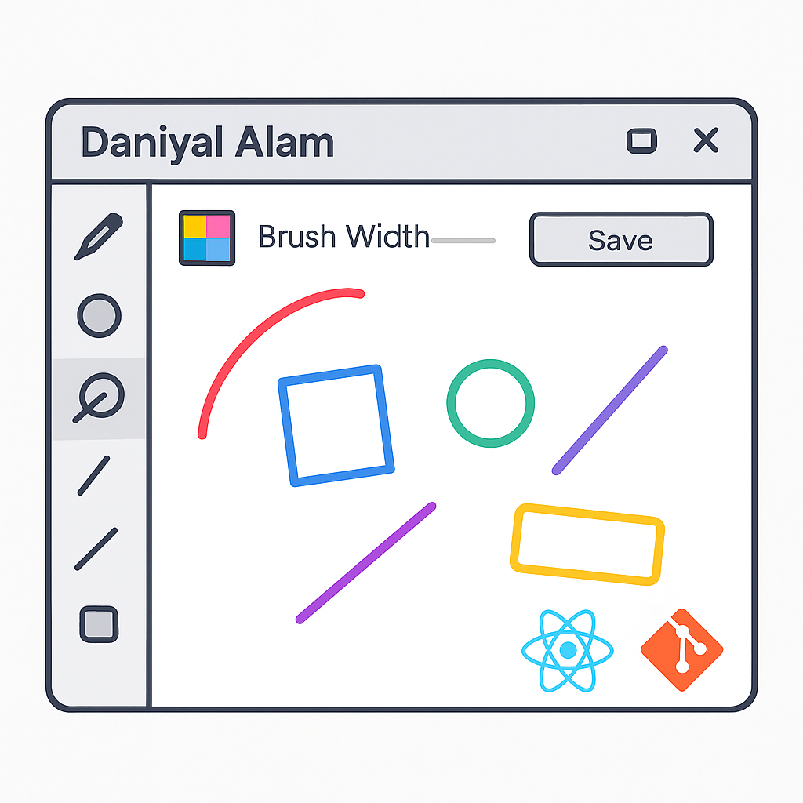

# 🖌️ Smart Drawing Canvas using Python and Tkinter

## 📄 Project Description
An interactive drawing app built with Python’s Tkinter. Users can draw with pen, shapes, and eraser, customize brush width and colors, and save their artwork. Includes a feature to embed a thank-you message honoring the Code in Place experience.  
*Created for Stanford’s Code in Place 2025.*

## ✨ Features
- Pen, rectangle, circle, and straight-line drawing tools  
- Eraser tool  
- Change cursor and canvas color  
- Adjustable brush width  
- Save artwork as image  
- Add 'Thank you Stanford CIP' message

## 🛠 Requirements
- Python 3.x  
- Tkinter (usually included with Python)  
- Pillow (Python Imaging Library)

## 🚀 Installation
```bash
# Clone the repository
git clone https://github.com/yourusername/drawing-canvas-python

# Navigate to the project directory
cd drawing-canvas-python

# Install dependencies
pip install pillow

# Run the app
python drawing_canvas.py
```

## 🖼 Screenshot


## 📚 Credits
Created as part of Stanford’s Code in Place 2025 by Daniyal Alam.
